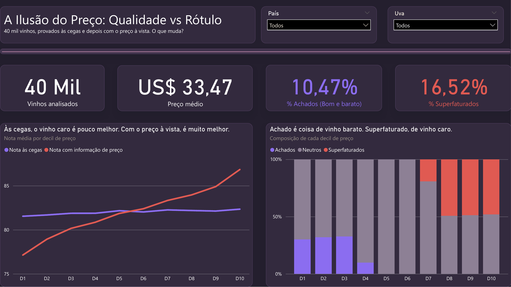
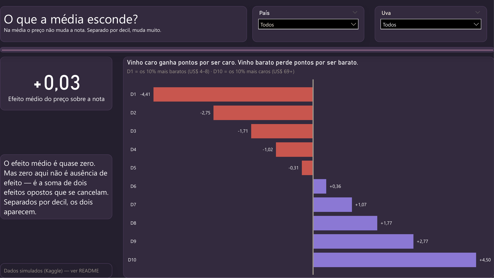
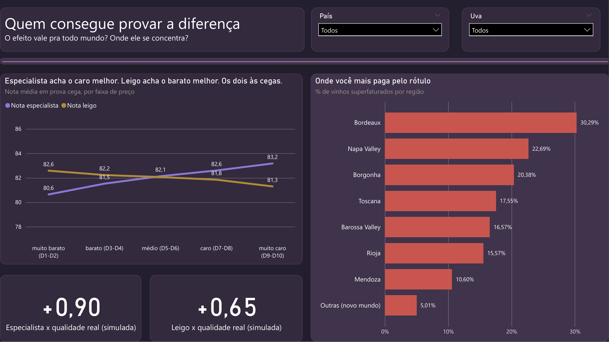

# Power BI Dashboards

[](https://powerbi.microsoft.com/)
[](https://learn.microsoft.com/dax/)
[](LICENSE)

Reports built in Power BI during the **Data Analyst program at EBAC**.

> 🇧🇷 Versão em português: [README.md](README.md)

Each dashboard ships the `.pbix` file to open and interact with, captures of every page, and model documentation under `docs/`.

---

## The Price Illusion — wine, label and blind tasting



Does knowing the price change the score you give a wine? The dataset holds 40,000 bottles rated twice — **blind**, and then **with the price visible**.

**The average price effect is +0.03 points.** That looks like no effect, and isn't: it is two opposing effects cancelling out.

| Price decile | Effect on the score |
|---|---:|
| D1 — cheapest 10% | **−4.41** |
| D10 — priciest 10% | **+4.50** |

Expensive wine gains points for being expensive; cheap wine loses points for being cheap. The average erases both.

From the cheapest decile to the priciest, the **blind** score moves 0.8 points. **With the price visible**, it moves 9.7. The difference is the label.



On the third page's two lines **nobody saw the price** — and still the expert and the novice disagree in direction: the expert's scores rise with the price band (80.6 → 83.2), the novice's fall (82.6 → 81.3).



> **A note on the data.** Checking the dataset mid-build, I concluded it is computer-generated rather than collected from real blind tastings. The figures above describe the generator's behaviour, not wine drinkers' — they are not evidence about how people perceive price. The modelling, DAX and visualisation exercise is unchanged.

**Technique:** 3 pages · 4 calculated columns · 13 DAX measures · Pearson written by hand with `SUMX`, because DAX has no `CORREL`.

**Data:** [Wine Price vs. Blind Quality](https://www.kaggle.com/datasets/sergionefedov/wine-price-vs-blind-qualitydo-you-pay-for-taste), by sergionefedov on Kaggle, CC0 1.0. The CSV is versioned under `ilusao-precos-vinhos/data/` so the report stays reproducible if the source dataset changes.

📁 [`ilusao-precos-vinhos/`](ilusao-precos-vinhos/)

---

## Sales — Latin America


A pet-supplies sales operation across seven Latin American countries, 2014–2017: **$73.65M revenue** and **$35.66M gross profit**, on a model of one fact table and six dimensions.

Three pages: *Visão Geral* (Overview), *Vendedores* (Sales reps) and *Insights* — the last carrying six analytical readings of the model rather than more charts.

**Key findings:**

- **Concentration** — Argentina and Colombia account for 59% of revenue. Two single points of commercial failure.
- **Uniform margin** — 1.8 pp spread between worst and best country. With no pricing power by market, the lever is volume.
- **Brazil is the outlier** — the region's largest economy, 6% of revenue, and the portfolio's worst margin.
- **2017** — a +36% jump over three flat years, across every product band. Points to a systemic factor.

> Fictional data, supplied as course material. These readings describe associations in the dataset, not causal relationships.

| Document | Contents |
|---|---|
| [Insights](docs/vendas-latam/insights.md) | The six analytical readings, with the method note |
| [Data model](docs/vendas-latam/modelo-de-dados.md) | Tables, relationships, and why the product branch is a snowflake |
| [DAX measures](docs/vendas-latam/medidas-dax.md) | All ten measures, with each expression explained |
| [Critical review](docs/vendas-latam/revisao-critica.md) | Open points and what the report gets right |

*(documentation is in Portuguese)*

📁 [`vendas-latam/`](vendas-latam/)

---

## Structure

```
powerbi-dashboards/
├── README.md / README.en.md
├── LICENSE · .gitignore · .gitattributes
│
├── ilusao-precos-vinhos/
│   ├── img/          # the 3 pages
│   ├── data/         # the CSV the report reads
│   └── powerbi/      # ilusao-do-preco.pbix
│
├── vendas-latam/
│   ├── img/          # the 3 pages
│   └── powerbi/      # .pbix plus the .pbip project in plain text
│
└── docs/
    └── vendas-latam/
```

Further reports get their own subfolder plus a folder under `docs/`.

## How to open

Requires **Power BI Desktop** ([free download](https://powerbi.microsoft.com/desktop/), Windows). Download the `.pbix` from the dashboard's folder and open it — the data is embedded in the model, no source to connect.

## On version-controlling Power BI files

A `.pbix` is a binary container: Git stores it but cannot diff it — every save becomes a full copy in history. The `.gitattributes` marks `*.pbix` as binary to stop Git attempting merges.

That is why `vendas-latam` also ships the **`.pbip`** (*Power BI Project*), which saves report and model as text files — there Git can show what changed between commits. Enable it under `File → Options → Preview features → Power BI Project (.pbip) save option`.

## Author

Study projects. Not professional work nor client commissions.

**Gustavo Hortêncio da Silva** — Economist (UFPB), training as a Data Analyst at EBAC.

[](https://github.com/gstvhortencio)

📊 Looker Studio dashboards: [looker-studio-dashboards](https://github.com/gstvhortencio/looker-studio-dashboards)
📚 Course notes: [ebac-analise-de-dados](https://github.com/gstvhortencio/ebac-analise-de-dados)

## Licence

Code and documentation under the MIT licence — see [`LICENSE`](LICENSE). The CSV under `ilusao-precos-vinhos/data/` derives from a CC0 1.0 dataset and keeps that licence.
