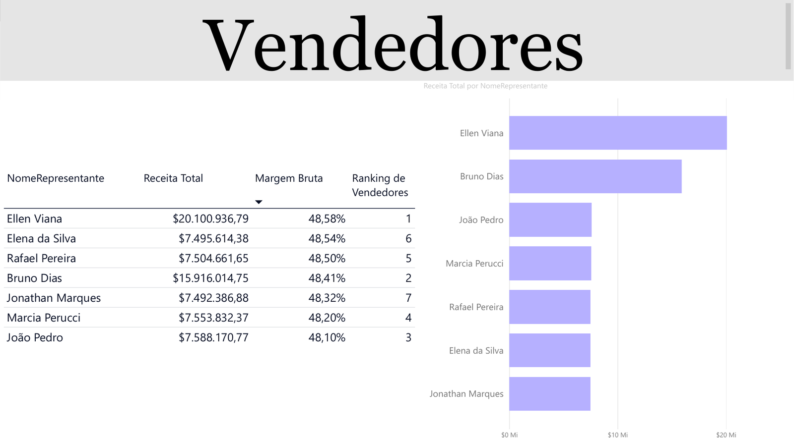
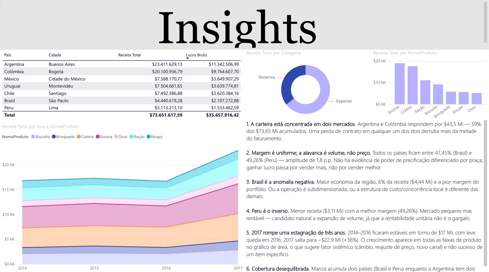

# Dashboards em Power BI

[](https://powerbi.microsoft.com/)
[](https://learn.microsoft.com/dax/)
[](LICENSE)

Relatórios construídos no Power BI durante o curso de **Analista de Dados da EBAC**.

> 🇬🇧 English version: [README.en.md](README.en.md)

Cada dashboard traz o arquivo `.pbix` para abrir e interagir, o projeto `.pbip` em texto para o Git conseguir comparar versões, as capturas das páginas e a documentação do modelo.

---

## Vendas — América Latina

Relatório de três páginas sobre uma operação de vendas de produtos para animais de estimação em sete países da América Latina (2014–2017, $73,65 Mi de receita e $35,66 Mi de lucro bruto), sobre um modelo de uma fato e seis dimensões.


### O que o relatório responde

| Página | Pergunta que responde |
|---|---|
| **Visão Geral** | Como a receita evoluiu no tempo e como ela se distribui entre países? |
| **Vendedores** | Quem vende mais, com que margem, e como a equipe se ordena? |
| **Insights** | O que os números acima implicam para a decisão? |

A terceira página é o núcleo do trabalho: em vez de mais gráficos, ela traz seis leituras analíticas do modelo — concentração de carteira, comportamento da margem entre praças, anomalias por país e a quebra de tendência em 2017.

### Principais achados

**Concentração** — Argentina e Colômbia somam 59% da receita acumulada. Dois pontos únicos de falha comercial.

**Margem uniforme** — a amplitude entre o pior e o melhor país é de 1,8 p.p. (47,45% no Brasil, 49,26% no Peru). Sem poder de precificação diferenciado por praça, a alavanca de lucro é volume, não preço.

**Brasil destoa** — maior economia da região, apenas 6% da receita e a pior margem do portfólio.

**2017** — salto de +36% sobre um patamar estável de três anos, distribuído por todas as faixas de produto. O padrão sugere fator sistêmico, não sucesso de um produto.

> Os dados são fictícios, fornecidos como material didático. As leituras descrevem associações no conjunto de dados, não relações causais.

### Números do modelo

| País | Cidade | Receita Total | Lucro Bruto | Margem |
|---|---|---:|---:|---:|
| Argentina | Buenos Aires | $23.411.629 | $11.342.507 | 48,45% |
| Colômbia | Bogotá | $20.100.937 | $9.764.608 | 48,58% |
| México | Cidade do México | $7.588.171 | $3.649.907 | 48,10% |
| Uruguai | Montevidéu | $7.504.662 | $3.639.775 | 48,50% |
| Chile | Santiago | $7.492.387 | $3.620.384 | 48,32% |
| Brasil | São Paulo | $4.440.619 | $2.107.273 | 47,45% |
| Peru | Lima | $3.113.213 | $1.533.463 | 49,26% |
| **Total** | | **$73.651.618** | **$35.657.916** | **48,41%** |

**Produtos** — sete itens (Biscoito, Brinquedo, Coleira, Escova, Osso, Ração, Roupa) em duas categorias (Genérica, Especial).

**Equipe** — sete representantes, com alocação que não é um-para-um com os países: Ellen Viana cobre a Colômbia sozinha; a Argentina é dividida entre Elena da Silva e Bruno Dias (cujas receitas somam exatamente os $23.411.629 do país); e Marcia Perucci acumula Brasil e Peru (soma exata de $7.553.832). É dessa aritmética que sai o insight 6.

### As páginas





### Documentação

| Documento | Conteúdo |
|---|---|
| [Insights](docs/vendas-latam/insights.md) | As seis leituras analíticas, com a nota de método |
| [Modelo de dados](docs/vendas-latam/modelo-de-dados.md) | Tabelas, relacionamentos, e por que o ramo de produto é floco de neve |
| [Medidas DAX](docs/vendas-latam/medidas-dax.md) | As dez medidas, com expressão e explicação de cada uma |
| [Revisão crítica](docs/vendas-latam/revisao-critica.md) | Sete pontos em aberto com a correção de cada, e o que o relatório resolve bem |

### As medidas

Dez medidas, todas em `fact_Vendas`:

| Grupo | Medidas |
|---|---|
| Base | `Receita Total`, `Custo Total`, `Lucro Bruto`, `Margem Bruta` |
| Inteligência temporal | `Receita YTD`, `Receita YTD LY`, `Receita MTD`, `Receita MAT` |
| Ranking e participação | `Ranking de Vendedores`, `Market Share % (por país)` |

As duas medidas base são iteradores, não somas simples:

```dax
Receita Total =
SUMX(
    fact_Vendas,
    fact_Vendas[Unidades]
        * RELATED(dim_Produto[PrecoVarejo])
        * (1 - fact_Vendas[DescontoDeReceita])
)
```

Como o desconto varia por transação, somar o produto linha a linha é o único cálculo correto — multiplicar as somas daria outro número.

### O modelo

Uma fato e seis dimensões. Geografia, calendário e representante ligam direto à fato (estrela); a hierarquia de produto se encadeia em dois saltos (floco de neve):

```
dim_Calendario   dim_Geografia   dim_Representante
       └───────────────┼───────────────┘
                  fact_Vendas
                       │
                  dim_Produto  →  dim_SubCategoria  →  dim_Categoria
```

### Como abrir

Requer **Power BI Desktop** ([download gratuito](https://powerbi.microsoft.com/desktop/), Windows).

```
1. Baixe vendas-latam/powerbi/dashboard-vendas.pbix
2. Abra o arquivo no Power BI Desktop
3. Os dados estão embutidos no modelo — não é necessário conectar nenhuma fonte
```

**Lendo o modelo sem abrir o Power BI** — a pasta `vendas-latam/powerbi/pbip/` traz o mesmo relatório em formato de projeto, onde tudo é texto:

| Arquivo | Conteúdo |
|---|---|
| `dashboard-vendas.SemanticModel/model.bim` | Tabelas, colunas, relacionamentos e as dez medidas DAX |
| `dashboard-vendas.Report/report.json` | Visualizações, campos e layout das três páginas |

O cache de dados foi removido (`.pbi/`), então essa pasta descreve o modelo mas não contém os dados — para ver os números, use o `.pbix`.

---

## Estrutura

```
powerbi-dashboards/
├── README.md / README.en.md
├── LICENSE
├── .gitattributes             # marca .pbix como binário para o Git
├── vendas-latam/
│   ├── img/
│   │   ├── 01-visao-geral.png
│   │   ├── 02-vendedores.png
│   │   └── 03-insights.png
│   └── powerbi/
│       ├── dashboard-vendas.pbix
│       └── pbip/
│           ├── dashboard-vendas.pbip
│           ├── dashboard-vendas.Report/
│           └── dashboard-vendas.SemanticModel/
└── docs/
    └── vendas-latam/
        ├── insights.md
        ├── modelo-de-dados.md
        ├── medidas-dax.md
        └── revisao-critica.md
```

Novos relatórios entram como subpastas próprias conforme o curso avança.

## Sobre versionar arquivos do Power BI

O `.pbix` é um contêiner binário (um `.zip` com o modelo comprimido dentro). O Git armazena, mas não consegue comparar versões: cada salvamento vira uma cópia inteira no histórico. Por isso o `.gitattributes` marca `*.pbix` como binário, evitando tentativas de merge.

Por isso também cada dashboard traz **as duas versões**: o `.pbix` para quem quer abrir e interagir, e o `.pbip` para o Git conseguir mostrar o que mudou entre commits. O `.pbip` ativa-se em `Arquivo → Opções → Recursos de visualização → Salvar como Projeto do Power BI`.

## Autor

**Gustavo Hortêncio da Silva** — Economista (UFPB), em formação como Analista de Dados pela EBAC.

[](https://github.com/gstvhortencio)

📊 Dashboards em Looker Studio: [looker-studio-dashboards](https://github.com/gstvhortencio/looker-studio-dashboards)
📚 Anotações do curso: [ebac-analise-de-dados](https://github.com/gstvhortencio/ebac-analise-de-dados)

## Licença

Distribuído sob a licença MIT. Veja [`LICENSE`](LICENSE).
