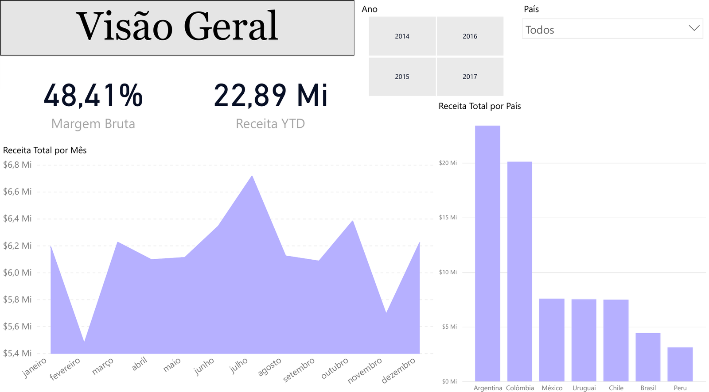

# Dashboards em Power BI

[](https://powerbi.microsoft.com/)
[](https://learn.microsoft.com/dax/)
[](LICENSE)

Relatórios construídos no Power BI durante o curso de **Analista de Dados da EBAC**.

> 🇬🇧 English version: [README.en.md](README.en.md)

Cada dashboard traz o arquivo `.pbix` para abrir e interagir, as capturas das páginas e a documentação do modelo em `docs/`.

---

## A Ilusão do Preço — vinho, rótulo e prova cega


Saber o preço muda a nota que você dá a um vinho? A base traz 40.000 garrafas provadas duas vezes — **às cegas** e depois **com o preço à vista**.

**O efeito médio é +0,03 ponto.** Parece ausência de efeito, e não é: é a soma de dois efeitos opostos que se cancelam.

| Decil de preço | Efeito sobre a nota |
|---|---:|
| D1 — os 10% mais baratos | **−4,41** |
| D10 — os 10% mais caros | **+4,50** |

Vinho caro ganha pontos por ser caro; vinho barato perde pontos por ser barato. A média apaga os dois.

Do decil mais barato ao mais caro, a nota **às cegas** anda 0,8 ponto. **Com o preço à vista**, anda 9,7 pontos. A diferença é o rótulo.


Nas duas linhas da terceira página **ninguém viu o preço** — e ainda assim especialista e leigo discordam de direção: o especialista dá notas crescentes conforme a faixa de preço sobe (80,6 → 83,2), o leigo faz o inverso (82,6 → 81,3).


> **Nota sobre os dados.** Checando a base durante a construção, concluí que ela é gerada por computador, não coletada de provas cegas reais. Os números acima descrevem o comportamento do gerador, não o de bebedores de vinho — não servem como evidência sobre percepção humana de preço. O exercício de modelagem, DAX e visualização é o mesmo.

**Técnica:** 3 páginas · 4 colunas calculadas · 13 medidas DAX · Pearson escrito na mão com `SUMX`, porque o DAX não tem `CORREL`.

**Dados:** [Wine Price vs. Blind Quality](https://www.kaggle.com/datasets/sergionefedov/wine-price-vs-blind-qualitydo-you-pay-for-taste), por sergionefedov no Kaggle, sob CC0 1.0. O CSV está versionado em `ilusao-do-preco/data/` para que o relatório continue reproduzível se o dataset de origem mudar.

📁 [`ilusao-do-preco/`](ilusao-do-preco/)

---

## Vendas — América Latina



Operação de vendas de produtos para animais de estimação em sete países da América Latina, 2014–2017: **$73,65 Mi de receita** e **$35,66 Mi de lucro bruto**, sobre um modelo de uma fato e seis dimensões.

Três páginas: *Visão Geral*, *Vendedores* e *Insights* — esta última com seis leituras analíticas do modelo, não mais gráficos.

**Principais achados:**

- **Concentração** — Argentina e Colômbia somam 59% da receita. Dois pontos únicos de falha comercial.
- **Margem uniforme** — amplitude de 1,8 p.p. entre o pior e o melhor país. Sem poder de precificação por praça, a alavanca é volume.
- **Brasil destoa** — maior economia da região, 6% da receita e a pior margem do portfólio.
- **2017** — salto de +36% sobre três anos estáveis, em todas as faixas de produto. Sugere fator sistêmico.

> Dados fictícios, fornecidos como material didático. As leituras descrevem associações no conjunto de dados, não relações causais.

| Documento | Conteúdo |
|---|---|
| [Insights](docs/vendas-latam/insights.md) | As seis leituras analíticas, com a nota de método |
| [Modelo de dados](docs/vendas-latam/modelo-de-dados.md) | Tabelas, relacionamentos e por que o ramo de produto é floco de neve |
| [Medidas DAX](docs/vendas-latam/medidas-dax.md) | As dez medidas, com expressão e explicação |
| [Revisão crítica](docs/vendas-latam/revisao-critica.md) | Pontos em aberto e o que o relatório resolve bem |

📁 [`vendas-latam/`](vendas-latam/)

---

## Estrutura

```
powerbi-dashboards/
├── README.md / README.en.md
├── LICENSE · .gitignore · .gitattributes
│
├── ilusao-do-preco/
│   ├── img/          # as 3 páginas
│   ├── data/         # o CSV usado pelo relatório
│   └── powerbi/      # ilusao-do-preco.pbix
│
├── vendas-latam/
│   ├── img/          # as 3 páginas
│   └── powerbi/      # .pbix e o projeto .pbip em texto
│
└── docs/
    └── vendas-latam/
```

Novos relatórios entram como subpasta própria, mais uma pasta em `docs/`.

## Como abrir

Requer **Power BI Desktop** ([download gratuito](https://powerbi.microsoft.com/desktop/), Windows). Baixe o `.pbix` da pasta do dashboard e abra — os dados estão no modelo, não é preciso conectar fonte.

## Sobre versionar arquivos do Power BI

O `.pbix` é um contêiner binário: o Git armazena, mas não compara versões — cada salvamento vira uma cópia inteira no histórico. O `.gitattributes` marca `*.pbix` como binário para evitar tentativas de merge.

Por isso o `vendas-latam` traz também o **`.pbip`** (*Power BI Project*), que salva relatório e modelo como arquivos de texto — aí o Git mostra o que mudou entre commits. Ativa-se em `Arquivo → Opções → Recursos de visualização → Salvar como Projeto do Power BI`.

## Autor

Projetos de estudo. Não são trabalho profissional nem encomenda de cliente.

**Gustavo Hortêncio da Silva** — Economista (UFPB), em formação como Analista de Dados pela EBAC.

[](https://github.com/gstvhortencio)

📊 Dashboards em Looker Studio: [looker-studio-dashboards](https://github.com/gstvhortencio/looker-studio-dashboards)
📚 Anotações do curso: [ebac-analise-de-dados](https://github.com/gstvhortencio/ebac-analise-de-dados)

## Licença

Código e documentação sob licença MIT — ver [`LICENSE`](LICENSE). O CSV em `ilusao-do-preco/data/` deriva de dataset sob CC0 1.0 e mantém essa licença.
